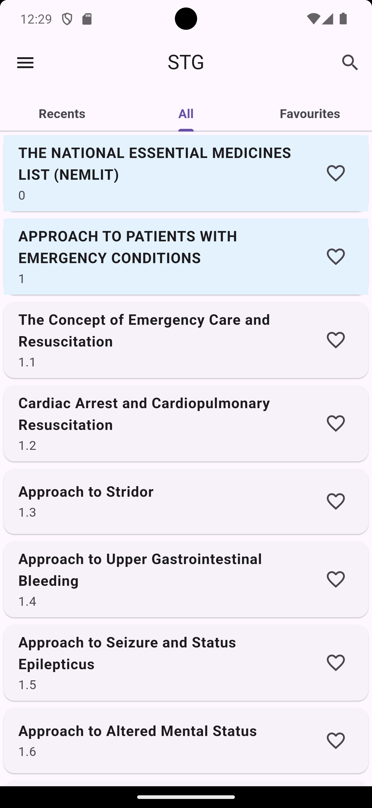
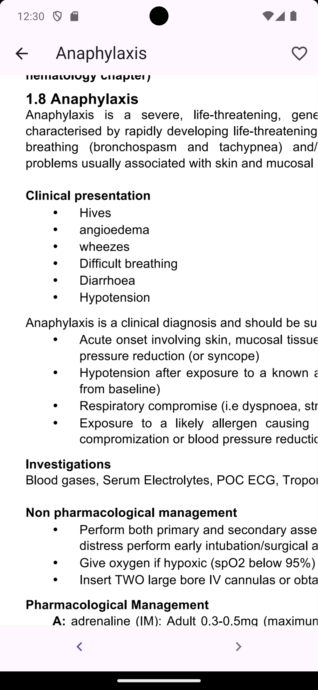

# STG

A wrapper of _"The United Republic Of Tanzania Standard Treatment Guidelines And National Essential Medicines List For Tanzania Mainland"_ book.

Easily navigate the book with this app. No more struggling to find specific topics; quick access and a user-friendly design make reading and referencing simple and efficient.

## Screenshots

<p align="center">
    
    &nbsp;
    
    &nbsp;
    
</p>

## How to Install it

1. Download APK with latest version from [here](https://github.com/kateile/STG/releases).

## Todo

- progress with percent
- most viewed
- search with recent searches
- questions and answers and bonus points
- <https://pdf.online/crop-pdf>

## Building

### Appbundle
```bash
flutter build appbundle --obfuscate --split-debug-info=./build/app/outputs/symbols 
```

### Apk

```bash
flutter build apk --obfuscate --split-debug-info=./build/app/outputs/symbols --release
```
